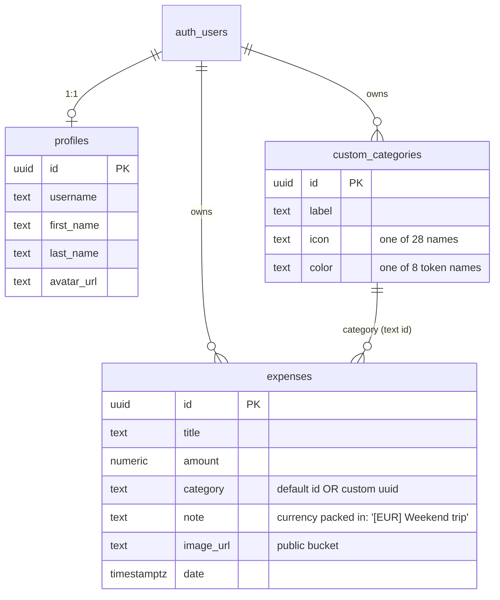
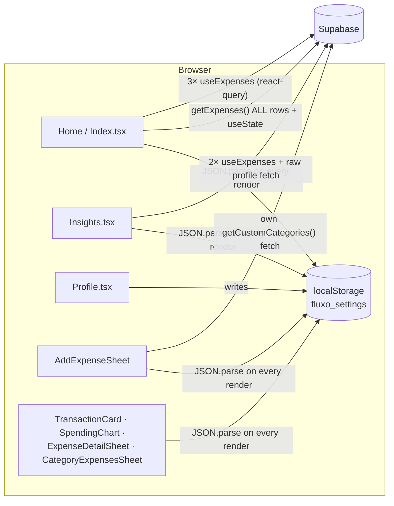

# Structural changes log

How the code and data are organized, before and after. The v1 section documents the state at tag `v1.0.0`. Each phase adds its "after" sections below it.

---

## v1 baseline

### Data model

Notes:
- **The 8 default categories are hard-coded** in `DEFAULT_CATEGORIES` ([expenses.ts](../../src/lib/expenses.ts)), not stored in the database, so users can't rename or hide them.
- **Currency has no column.** It is written into `note` as a `[XXX] ` prefix and parsed back out with a regex (`parseNote`/`stringifyNote` in [currencies.ts](../../src/lib/currencies.ts)).
- **Settings (budget, currency, cycle day, period type) aren't in the database** (see below).

### Data flow

- **Settings are read with `JSON.parse(localStorage…)` in 8 files**, so each device has its own settings.
- **Fetching is mixed.** Home loads *every* expense imperatively into `useState`, and also runs three react-query range queries. After a save it reloads by hand, and the react-query caches aren't invalidated.
- **Category colors are defined in 6 places**: `index.css` variables, `GRADIENT_COLORS` in both `Insights.tsx` and `SpendingChart.tsx`, and three separate Tailwind class maps (`AddExpenseSheet`, `TransactionCard`, `ExpenseDetailSheet`). Adding one color means editing all six.

### Date-range logic: three functions that disagree

| Function | Used by | Cycle day | Range for "current cycle" on 20 Sep |
|---|---|---|---|
| `getPeriodRange` | Home chart label & filter | **user setting** | 25 Aug 00:00 → **25 Sep 00:00** (end included) |
| `getActiveSalaryCycleRange` | Home total & weekly pulse | **hard-coded 25** | 25 Aug 00:00 → 24 Sep 23:59 |
| `getSalaryCycleRange` | Insights | **hard-coded 25** | 25 Aug 00:00 → **25 Sep 23:59** |

**Worked example (demo data):** "Payday brunch", $48.60 on **25 Aug**.
- Insights → *August* covers 25 Jul 00:00 → 25 Aug 23:59: **includes it**.
- Insights → *September* covers 25 Aug 00:00 → 25 Sep 23:59: **includes it again**.
- The August-vs-September comparison therefore counts that expense on both sides. The same happens to every expense logged on the 25th.
- If a user changes the cycle day in Profile to, say, the 1st, the Home chart follows the setting but the Home total and all of Insights stay on the 25th.

### Other findings
- **Theme persistence bug:** `ThemeToggle` has two effects. The first writes `"dark"` to storage before the second reads the saved value, so a light-theme choice is overwritten on every load.
- **The "biggest increase" insight only checks the default categories** and skips custom ones.
- **The receipt image bucket is public.**
- **Leftover files:** [`storage.ts`](../../src/lib/storage.ts) (the old localStorage data model) and three lockfiles (`bun.lock`, `bun.lockb`, `package-lock.json`).
- **Tests:** one placeholder test (`expect(true).toBe(true)`).

---

<!-- Phase "after" sections are appended below. -->
