# Structural changes log

How the code and data are organized, before and after. The v1 section documents the state at tag `v1.0.0`. Each phase adds its "after" sections below it.

---

## v1 baseline

### Data model

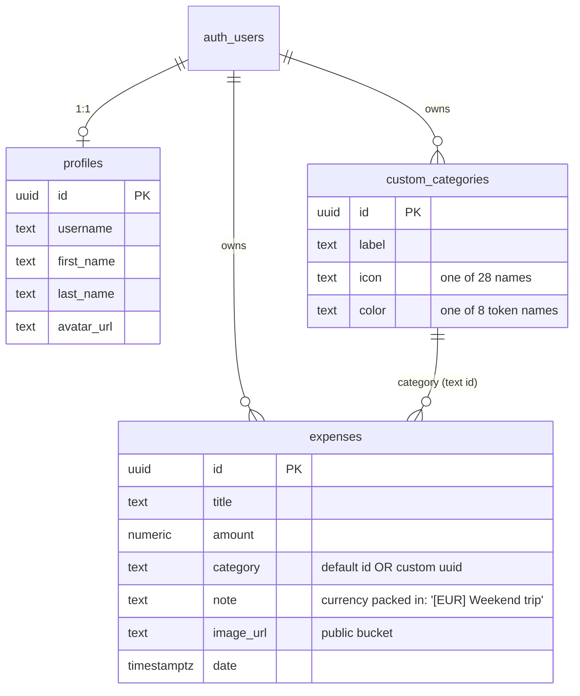

Notes:
- **The 8 default categories are hard-coded** in `DEFAULT_CATEGORIES` ([expenses.ts](../../src/lib/expenses.ts)), not stored in the database, so users can't rename or hide them.
- **Currency has no column.** It is written into `note` as a `[XXX] ` prefix and parsed back out with a regex (`parseNote`/`stringifyNote` in [currencies.ts](../../src/lib/currencies.ts)).
- **Settings (budget, currency, cycle day, period type) aren't in the database** (see below).

### Data flow

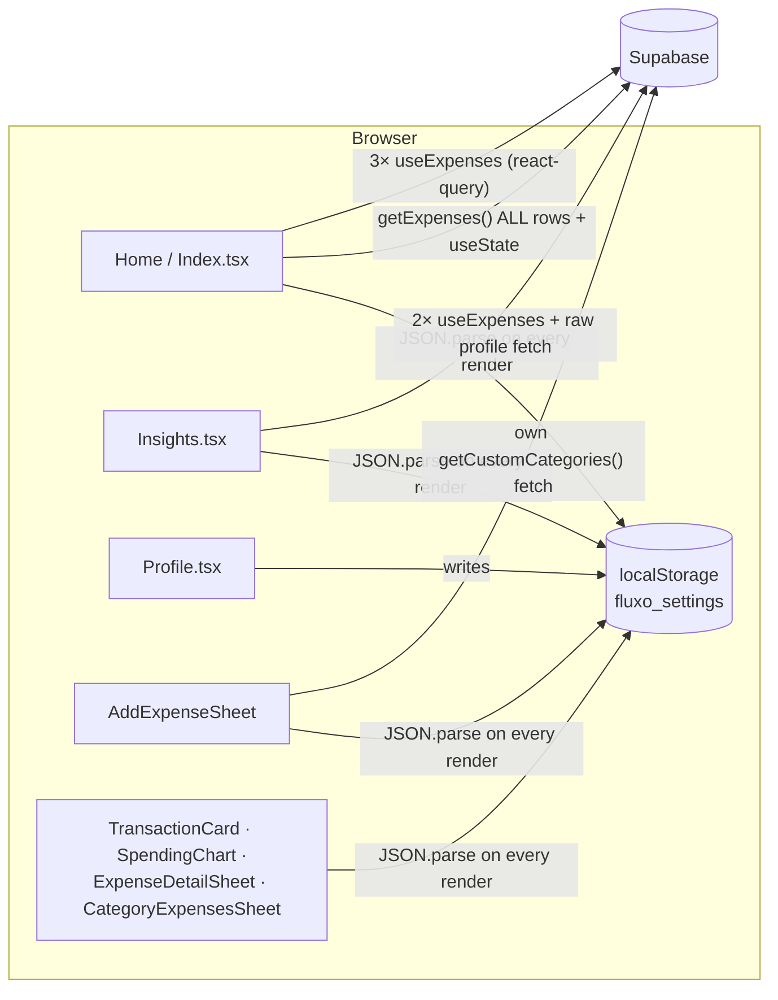

- **Settings are read with `JSON.parse(localStorage…)` in 8 files**, so each device has its own settings.
- **Fetching is mixed.** Home loads *every* expense imperatively into `useState`, and also runs three react-query range queries. After a save it reloads by hand, and the react-query caches aren't invalidated.
- **Category colors are defined in 6 places**: `index.css` variables, `GRADIENT_COLORS` in both `Insights.tsx` and `SpendingChart.tsx`, and three separate Tailwind class maps (`AddExpenseSheet`, `TransactionCard`, `ExpenseDetailSheet`). Adding one color means editing all six.

### Date-range logic: three functions that disagree

| Function | Used by | Cycle day | Range for "current cycle" on 20 Sep |
|---|---|---|---|
| `getPeriodRange` | Home chart label & filter | **user setting** | 25 Aug 00:00 → **25 Sep 00:00** (end included) |
| `getActiveSalaryCycleRange` | Home total & weekly pulse | **hard-coded 25** | 25 Aug 00:00 → 24 Sep 23:59 |
| `getSalaryCycleRange` | Insights | **hard-coded 25** | 25 Aug 00:00 → **25 Sep 23:59** |

**Worked example (demo data):** "Payday brunch", $48.60 on **25 Aug**.
- Insights → *August* covers 25 Jul 00:00 → 25 Aug 23:59: **includes it**.
- Insights → *September* covers 25 Aug 00:00 → 25 Sep 23:59: **includes it again**.
- The August-vs-September comparison therefore counts that expense on both sides. The same happens to every expense logged on the 25th.
- If a user changes the cycle day in Profile to, say, the 1st, the Home chart follows the setting but the Home total and all of Insights stay on the 25th.

### Other findings
- **Theme persistence bug:** `ThemeToggle` has two effects. The first writes `"dark"` to storage before the second reads the saved value, so a light-theme choice is overwritten on every load.
- **The "biggest increase" insight only checks the default categories** and skips custom ones.
- **The receipt image bucket is public.**
- **Leftover files:** [`storage.ts`](../../src/lib/storage.ts) (the old localStorage data model) and three lockfiles (`bun.lock`, `bun.lockb`, `package-lock.json`).
- **Tests:** one placeholder test (`expect(true).toBe(true)`).

---

## Phase 0: Foundations

Full write-up: [00-foundations.md](00-foundations.md).

### Data model (after Phase 0)

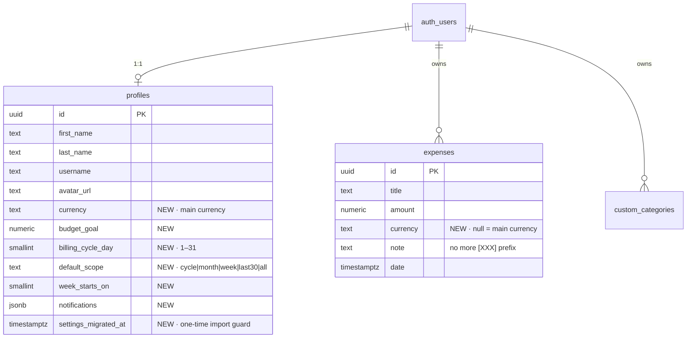

### Data flow (after Phase 0)

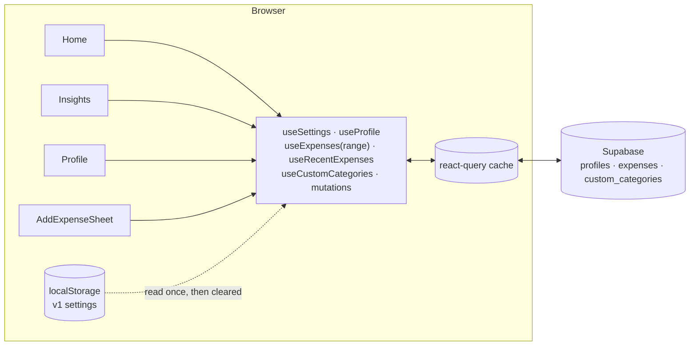

- **One source per kind of data:** settings come from the profile row via `useSettings()`; expenses are always fetched by range with `useExpenses(range)`, which never loads "all rows".
- **Writes go through mutations** that invalidate `["expenses"]` or `["custom_categories"]`, so every screen that shows the data refreshes.
- **Components don't touch localStorage.** The only storage left is the theme (per device, on purpose) and the one-time v1 import.

### Date-range logic (after Phase 0)

| | v1 | v2 |
|---|---|---|
| Functions | 6, with different end-date conventions | `getScopeRange`, `getPreviousRange`, `getCycleRange`, `getCycleWeek` |
| Range convention | Mixed (end at 00:00, 23:59 or "day before") | Half-open `[start, end)` everywhere; queries use `gte`/`lt` |
| Cycle day | Setting on Home chart, hard-coded 25 elsewhere | Setting everywhere; days 29–31 snap to month end |
| The Aug 25 example | Counted in August **and** September | Counted in September only (regression test) |

### Category styling (after Phase 0)

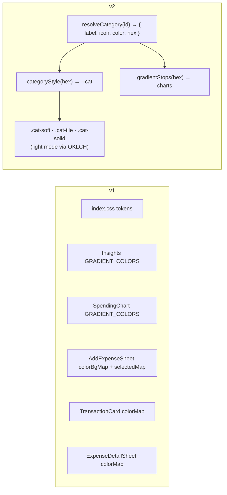

v1 color tokens (`"mint"`, `"coral"`…) are still accepted and map to their exact v1 hex values, so existing custom categories keep their colors without a data migration.

### Tests

| | v1 | Phase 0 |
|---|---|---|
| Test files | 1 (placeholder) | 2 |
| Tests | 1 (`expect(true)`) | 31 |
| Covered | — | date ranges, cycle edge cases, double-count regression, category resolution, currency split, settings mapping & v1 import |

---

<!-- Phase "after" sections are appended below. -->

## Phase 1a: Categories 2.0

Full write-up: [01a-categories.md](01a-categories.md).

### Data model (after Phase 1a)

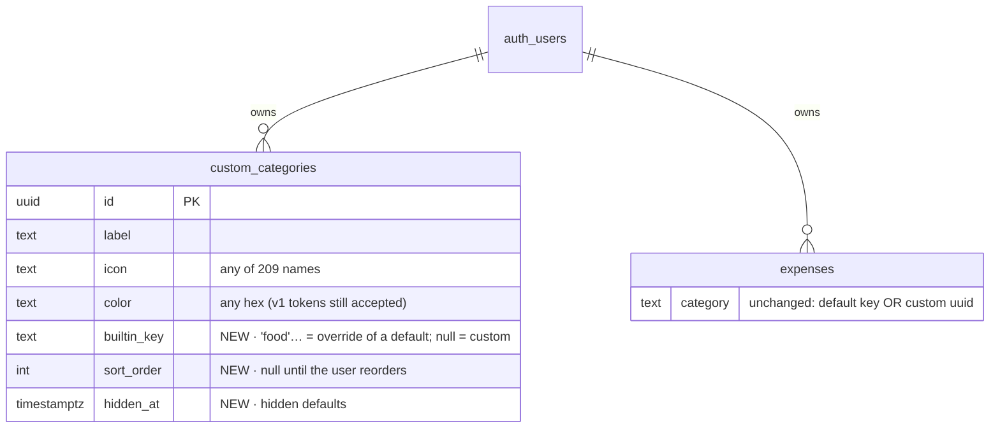

- **No expense rows changed.** Defaults are still referenced by key (`'food'`). A user's changes to a default live in an override row with `builtin_key = 'food'`, unique per user.
- **`delete_category(p_category, p_move_to)`** moves the category's expenses and then deletes it (custom) or hides it (default), in one transaction. It runs as the caller, so row-level security applies, and anonymous users can't execute it.

### How a category is resolved

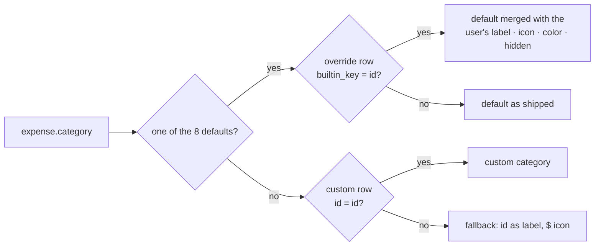

`allCategories()` then orders them by `sort_order`, falling back to v1's order (defaults, then custom by creation date), and leaves out hidden ones unless asked.

### Writes

| Action | Request(s) |
|---|---|
| Create | `insert` with `sort_order` = after the last category |
| Edit a custom category | `update … where id` |
| Edit a default | `upsert … on conflict (user_id, builtin_key)` |
| Reorder | Create any missing override rows (`ignore duplicates`), then one batched upsert for defaults and one for custom rows. Applied to the cache first (optimistic), rolled back if it fails |
| Delete / hide | Make sure the override row exists (defaults), then `rpc('delete_category')` |
| Restore | `update hidden_at = null` |

### Bundle

| | Phase 0 | Phase 1a |
|---|---|---|
| Main JS (gzip) | 386 KB | 401 KB |
| Icon catalog (gzip, loaded on demand) | — | 160 KB |
| Icons in the main bundle | 28 | 28 (v1's, so existing categories render instantly) |

### Tests

| | Phase 0 | Phase 1a |
|---|---|---|
| Unit tests | 31 | 41 |
| End-to-end | scripted once | `npm run smoke:categories`, 22 checks, committed |

## Phase 1b: Insights scope & comparisons

Full write-up: [01b-insights-scope.md](01b-insights-scope.md).

### When does a cycle start?

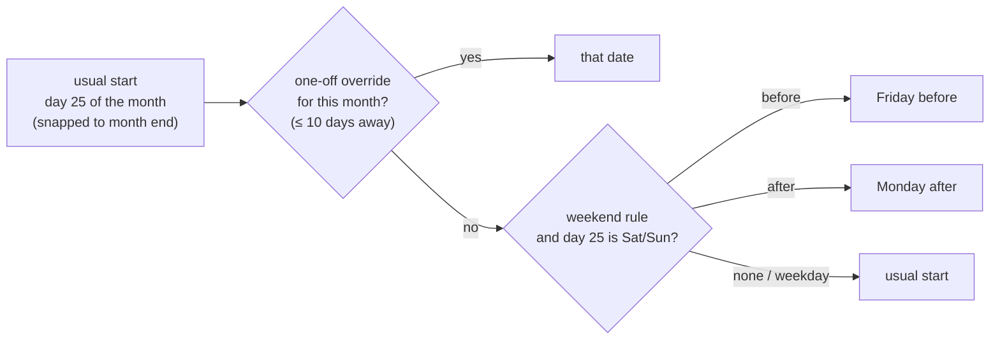

`cycleStart(year, month, cycleDay, payday)` answers this for one month. `getCycleRange()` then walks from the anchor's month to the cycle whose `[start, next start)` contains it, because a moved start can fall in the previous or next month. A cycle always ends where the next one starts, so moving a payday resizes two neighbouring cycles and nothing else. A test checks 18 consecutive cycles for gaps and overlaps.

### Data model (after Phase 1b)

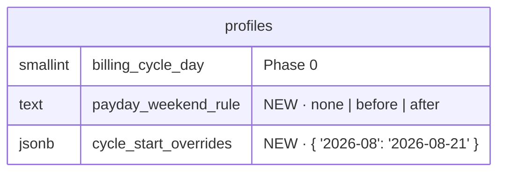

### Comparing periods

| Step | Function |
|---|---|
| The selected period plus the N before it (oldest first) | `getRecentRanges(range, scope, opts, N)` |
| Cut earlier periods at the point the current one has reached | `samePointIn(range, current, now)` |
| Total vs previous / vs average of ≤3 (leaving out empty periods) | `comparePeriods(expenses, ranges, now, mode)` |
| The same comparison per category | `categoryComparison(expenses, range, baselineRanges)` |
| Chart bars + average of finished periods | `history(expenses, ranges, now)` |

All of these are pure functions in `lib/insights.ts` and `lib/date-utils.ts`. The page only fetches one date range (`ranges[0].start → range.end`) and renders.

### Tests

| | Phase 1a | Phase 1b |
|---|---|---|
| Unit tests | 41 | 62 |
| Browser checks | 22 (categories) | 22 (categories) + 22 (insights) |

## Phase 2: Fast backfill

Full write-up: [02-fast-backfill.md](02-fast-backfill.md).

### From text to saved expenses

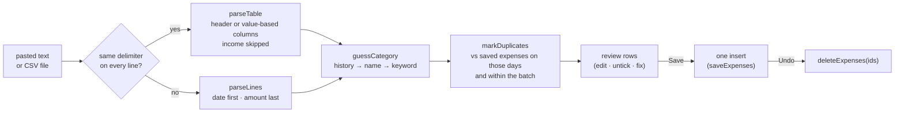

- **Everything before "review" is pure** (`lib/import.ts`) and covered by 44 unit tests.
- **No schema change:** a draft becomes a normal `expenses` row (noon on its day, with an explicit `currency`).
- **The history for guesses** is one small query (`title, category`, the last 1,000 expenses), cached for a minute.

### Bundle

| | Phase 1b | Phase 2 |
|---|---|---|
| Main JS (gzip) | 406 KB | 407 KB |
| Add expenses screen + parser (gzip, on demand) | — | 14 KB |

### Tests

| | Phase 1b | Phase 2 |
|---|---|---|
| Unit tests | 62 | 106 |
| Browser checks | 44 | 67 (categories 22 · insights 22 · backfill 23) |

## Polish after testing

Issues found while using v2 on a phone, fixed before tagging v2.0.0.

### Images: public → private

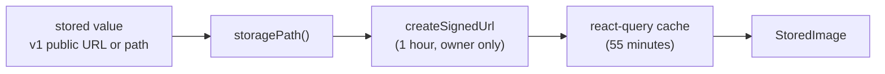

| | v1 → Phase 2 | Now |
|---|---|---|
| Bucket | Public: any file URL opens without signing in | Private (`20261001090000_private_images.sql`) |
| Stored in `image_url` / `avatar_url` | Full public URL | The file's path. Old URLs are still read |
| Shown with | `` | `StoredImage`, a signed link for the owner |
| Order of deploy | — | App first (signed links also work on a public bucket), then the migration |

### Clear all expense data

`clearExpenseData()` deletes the user's `expenses` rows (row-level security limits it to theirs) and every file in their storage folder except the avatar. Custom categories, settings and the profile stay.

### Theme switch

A global rule fades every element's background (0.3 s) and text (0.15 s) separately. On iOS this left boxes of the old theme behind text on the blurred Home card. `ThemeToggle` now turns transitions off for the one frame of the switch and, where the View Transitions API exists (Safari 18+, Chrome), cross-fades the whole page as one image.

### Lockfiles

`bun.lock` and `bun.lockb` came with the template. Vercel prefers bun when it finds them, so production installs weren't using the same lockfile as local development. Only `package-lock.json` remains.

### Tests

| | Phase 2 | Polish |
|---|---|---|
| Unit tests | 106 | 109 |
| Browser checks | 67 | 89 (+ fixes 22, in WebKit) |

## Notifications

v1 had three notification switches that were saved but never used. The weekly report now works as a push notification. The other two are marked Coming soon.

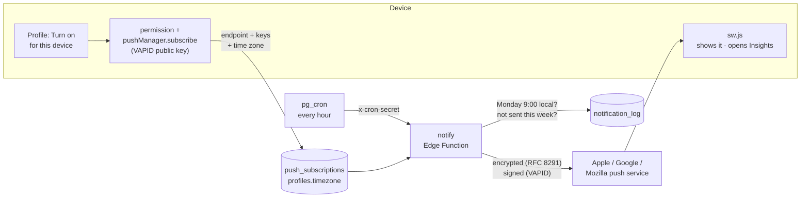

| Decision | Why | Trade-off accepted |
|---|---|---|
| Push, not email | No outside account needed, and friends get it too once they add Flux-o to the Home Screen | iPhone only allows it from the Home Screen app, one device at a time |
| Encryption and VAPID on Web Crypto | The common `web-push` package relies on Node crypto calls that may not exist in the Edge runtime. Web Crypto is identical in Deno and Node, so the unit tests exercise the same code | About 150 lines to own. Covered by a decrypt round-trip, a signature check and a real delivery through Google in `smoke:push` |
| Hourly job, "due from 9:00 Monday", log per week | Works in every time zone with one schedule. A missed or failed run is caught up the next hour, and the log stops repeats | Arrives between 9:00 and 9:59 |
| Secret for the schedule in Vault | Nothing secret is committed. The migration reads the URL and secret at run time | One extra SQL line when setting up |
| JWT check off for this function | The schedule has no user token. The function checks the cron secret, or the signed-in user, itself | That check lives in the function's code |

### Tests

| | Polish | Notifications |
|---|---|---|
| Unit tests | 109 | 118 |
| Browser checks | 89 | 105 (+ push 16, real Chrome) |
| Main JS (gzip) | 408 KB | 414 KB |
