# Visual changes log

Every change a user can see goes here, newest phase last. Each entry gives the **screen → what changed → why (the feedback it answers)**, followed by v1 and v2 screenshots of the same screen with the same demo data.

Screenshots are in [`screenshots/`](screenshots/). Captions use the mobile dark theme unless noted; every screen also exists in light theme and at desktop size under the same name.

---

## v1 baseline (tag `v1.0.0`)

| Home | Add expense | New category | Insights |
|---|---|---|---|
| 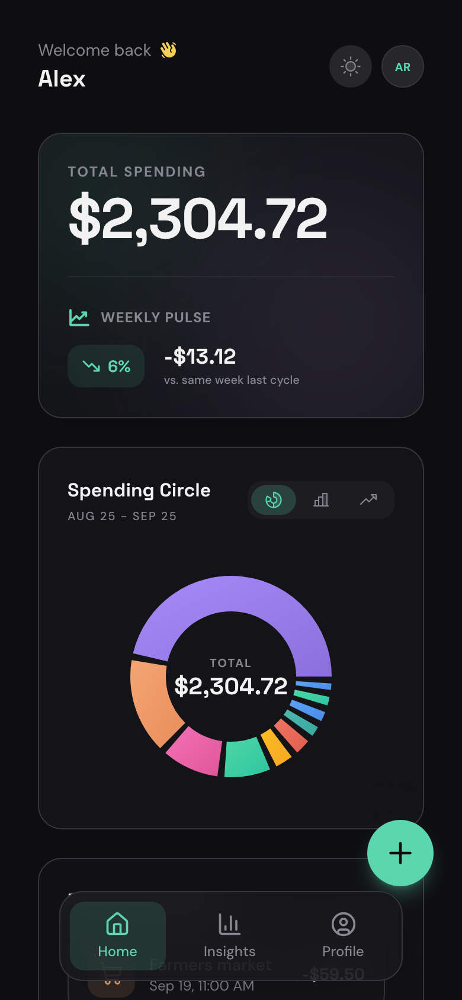 | 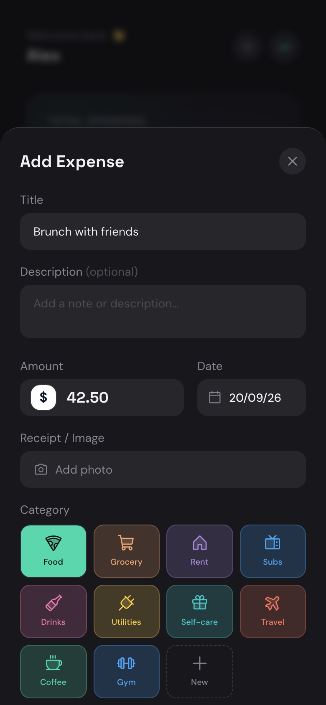 | 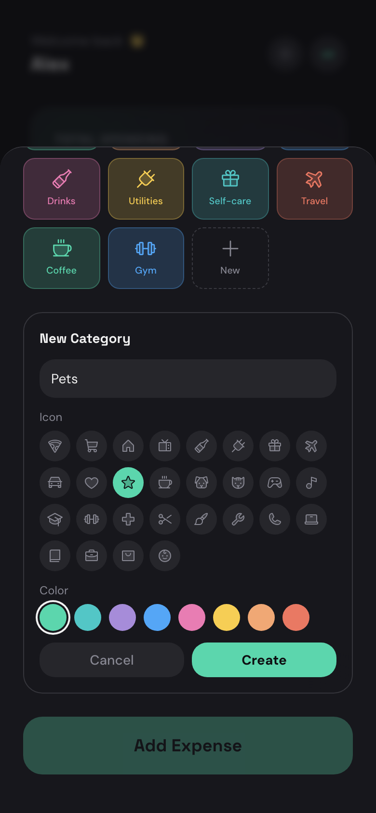 | 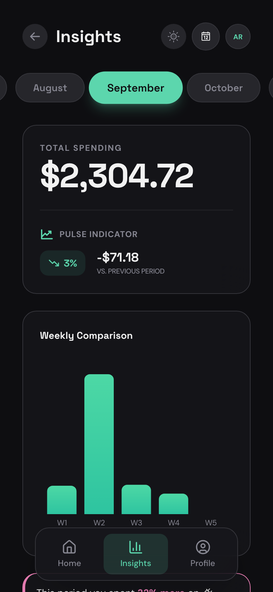 |

What the baseline shows, in the demo data:

- **Categories can't be told apart.** "Coffee" uses the same mint as "Food", and "Gym" the same blue as "Subs", because only 8 colors exist ([new-category](screenshots/v1/new-category.mobile.dark.png)).
- **The New Category form** has 28 icons in a fixed grid and 8 color dots. Once saved, a category can't be edited, deleted or renamed.
- **Insights** has one way to look at the data: a month chip, read as "the salary cycle ending on the 25th of that month", or a custom date range ([desktop](screenshots/v1/insights.desktop.dark.full.png)).
- **Mixed currencies** are shown with the wrong symbol: a €64 train ticket appears as "$64.00" under Travel and is counted in the dollar total.
- **The theme doesn't persist.** Choosing light mode works until the next reload, then the app is dark again. The v1 light-mode screenshots were captured by forcing the theme in the test harness.

---

<!-- Phase entries are appended below. Template:

## Phase X: <name>

### <Screen>: <what changed>
**Why:** <feedback / problem>
**Change:** <what's different>

| v1 | v2 |
|---|---|
|  |  |
-->

## Phase 0: Foundations

Phase 0 deliberately changes little on screen. Every visible difference below comes from the data being correct now. Full write-up: [00-foundations.md](00-foundations.md).

### Home → Total spending: other currencies shown separately
**Why:** v1 added a €64 train ticket to the dollar total as if it were $64.
**Change:** the total adds up the main currency only (**$2,240.72**, v1 $2,304.72). Other currencies are listed under it as *"+ €64.00 in other currency"*. The same line appears on the Insights total.

| v1 | v2 (Phase 0) |
|---|---|
|  | 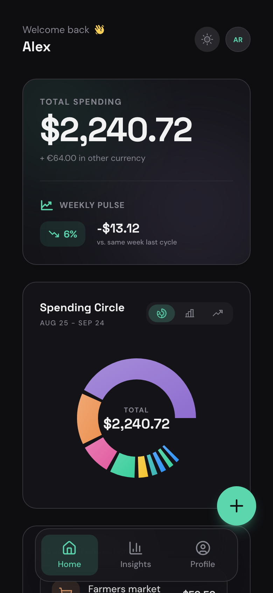 |

### Home → Spending Circle label: "Aug 25 – Sep 24"
**Why:** v1 showed "Aug 25 – Sep 25", so the next cycle's first day overlapped this one.
**Change:** ranges are half-open internally, and the label shows the last day actually included.

### Insights → comparison and breakdown
**Why:** v1 counted the $111.66 spent on Aug 25 in both the August and September cycles, and summed euros as dollars.
**Change:** the September vs August pulse is now **−$23.52 (−1%)** (v1 −$71.18, −3%). *Travel* leaves the breakdown because its only expense this cycle was in EUR. The "biggest increase" callout now also considers custom categories.

| v1 | v2 (Phase 0) |
|---|---|
| 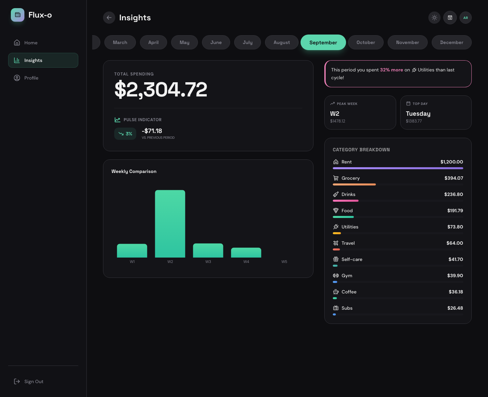 | 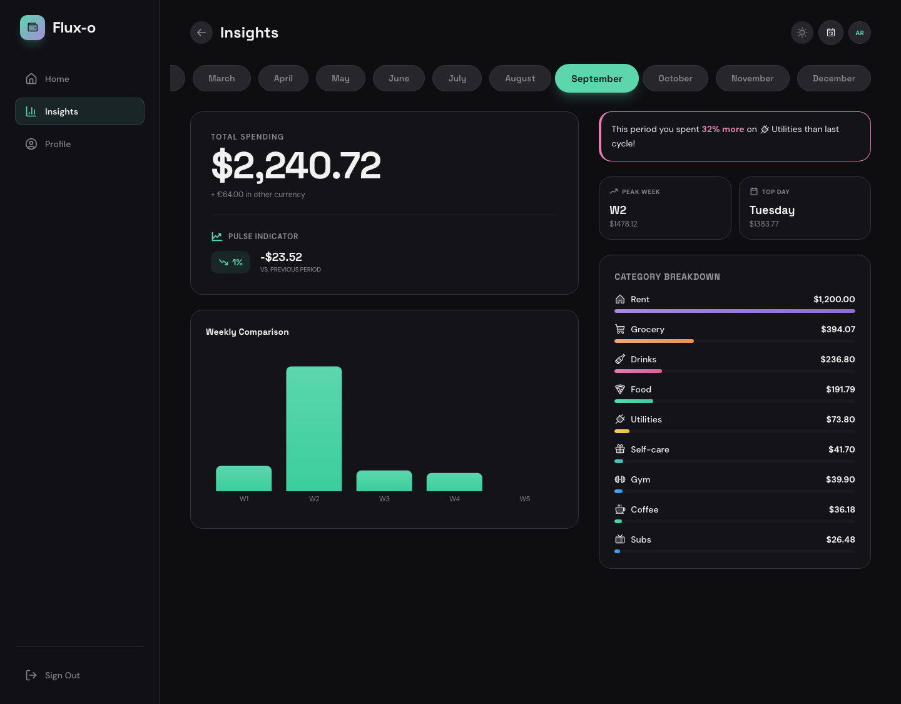 |

### Profile → Settings
**Why:** the cycle day was only shown when "billing cycle" was the display period, although the Home total always uses it. Settings didn't sync between devices.
**Change:** "Billing Cycle Start Day" is always visible, with a one-line explanation. The display-period options are *Billing cycle · Month · Week · Last 30 days · All time*. Settings save to the account.

| v1 | v2 (Phase 0) |
|---|---|
| 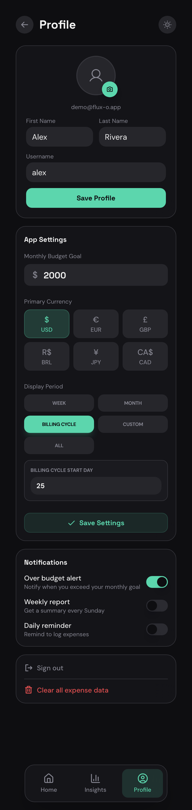 | 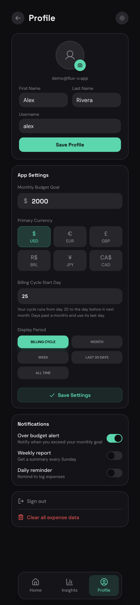 |

### Light theme persists
**Why:** v1 reset a saved light theme to dark on every reload.
**Change:** the theme is applied before the first paint and kept.

### Category colors: same look, new engine
**Why:** colors were defined in six places, and Phase 1a needs any color to work.
**Change:** no visual change intended. Tiles, chips and chart gradients all derive from one hex value per category. In light mode the tone is computed with OKLCH (same hue and saturation, darker) instead of a second hand-picked palette.

| v1 light | v2 light (Phase 0) |
|---|---|
| 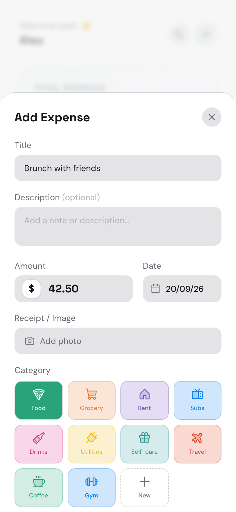 | 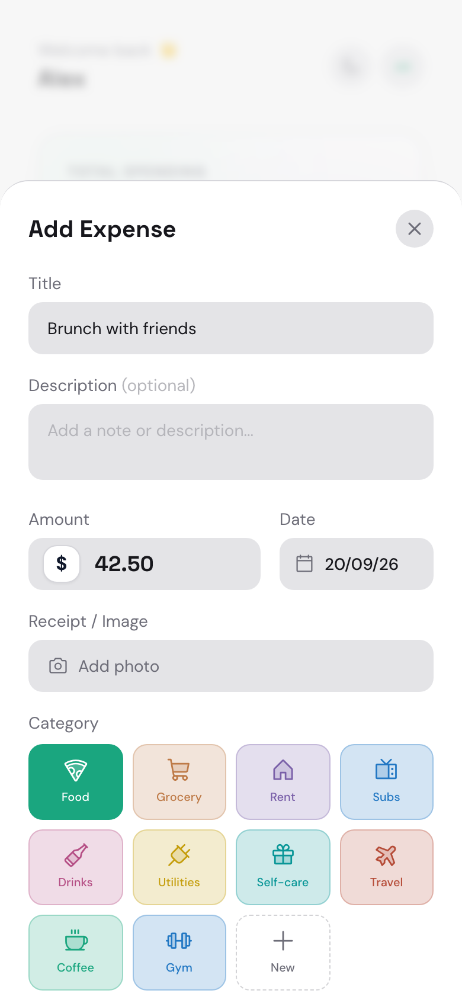 |

## Phase 1a: Categories 2.0

Answers the top piece of v1 feedback, *"Categories feel very limiting."* Full write-up: [01a-categories.md](01a-categories.md).

### New: Categories screen (Profile → Categories)
**Why:** in v1 a category couldn't be edited, deleted, renamed or moved once it was created.
**Change:** one list of every category in the user's order. Tap a row to edit it, and drag the handle (or use the arrow keys) to reorder. Defaults are labelled; hidden defaults appear in a "Hidden" section with Restore.

| v1 | v2 (Phase 1a) |
|---|---|
| *(no such screen: categories could only be created, in Add expense)* | 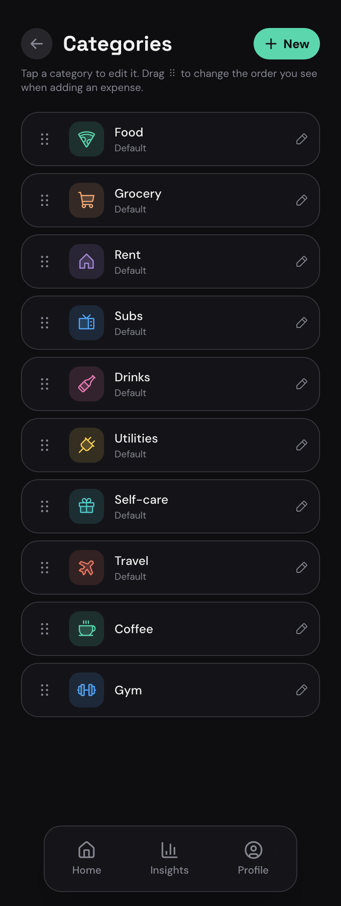 |

### New category: from 8 colors and 28 icons to 40 + any color and 209 searchable icons
**Why:** "Coffee" had to share Food's mint and "Gym" Subs' blue, because only 8 colors existed.
**Change:** the inline form is replaced by an editor sheet with a live preview. It has 5 rows × 8 hues of swatches (v1's palette is the first row), a custom color picker with a hex field, and icons grouped by theme with search. A new category is suggested a color that no other category uses yet.

| v1 | v2 (Phase 1a) |
|---|---|
|  | 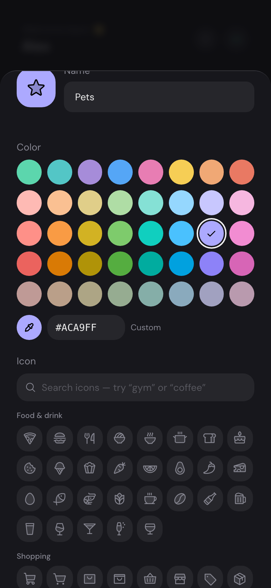 |

### Edit a category, e.g. give Coffee its own color
**Why:** the demo's "Coffee" was indistinguishable from "Food".
**Change:** the same editor opens for existing categories, defaults included. The image shows Coffee moved to "Deep orange".

| v2 (Phase 1a): edit | v2 (Phase 1a): icon search "sport" |
|---|---|
| 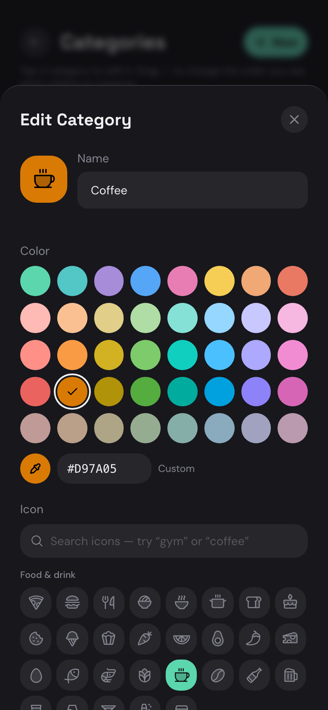 | 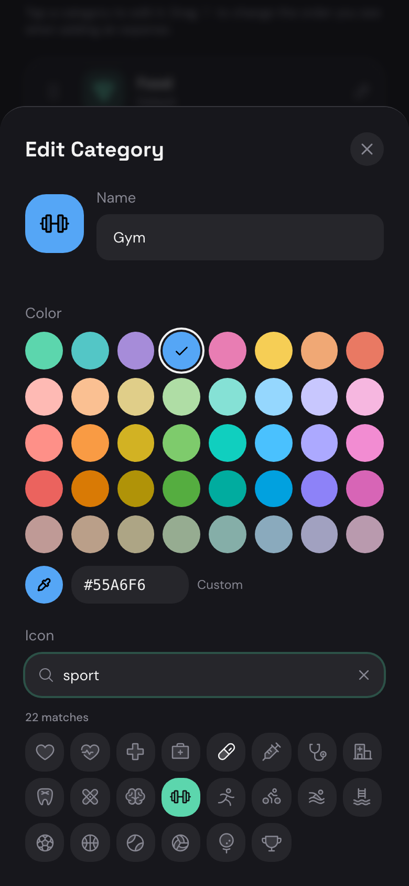 |

### Delete: expenses are moved, never orphaned
**Why:** deleting a category that still has expenses would leave them without a category.
**Change:** the dialog shows how many expenses the category has and asks where to move them before "Move & delete" is enabled. Default categories are hidden instead of deleted.

| v2 (Phase 1a) |
|---|
| 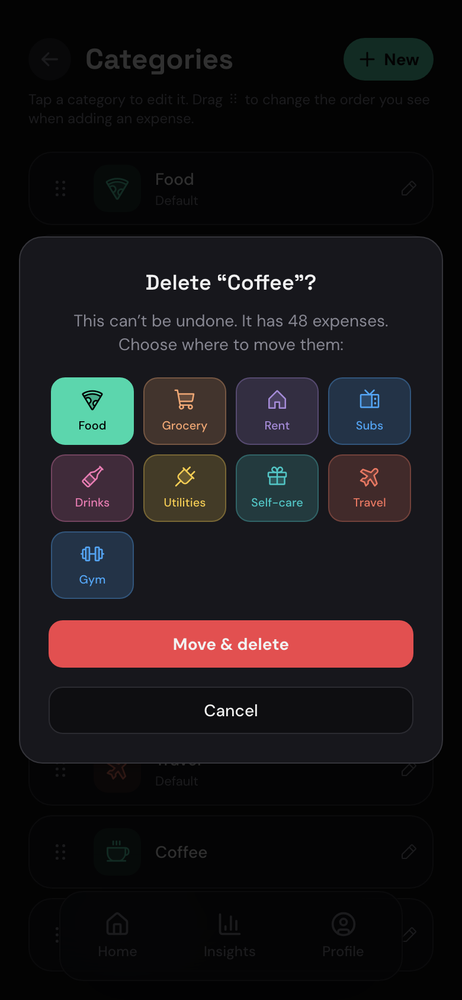 |

### Profile: a Categories card
**Change:** it sits between App Settings and Notifications, with a preview of the first 7 categories and a count.

| Phase 0 | Phase 1a |
|---|---|
|  | 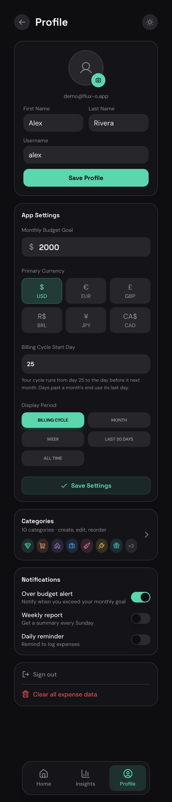 |

### Add expense: "New" and "Manage"
**Change:** "New" opens the category editor on top of the sheet, and the new category is selected when saved. "Manage" opens the Categories screen. The grid follows the user's order and names, and leaves out hidden categories.

### Light mode: readable text on selected tiles
**Why:** v1 always used white text on a filled tile, which was hard to read on light colors like yellow. With custom colors, anything is possible.
**Change:** the text is black or white, whichever contrasts more. In the demo, the selected "Food" tile now has black text. Very light custom colors are also darkened a little in light mode, and very dark ones lifted in dark mode.

| Phase 0 light | Phase 1a light |
|---|---|
|  | 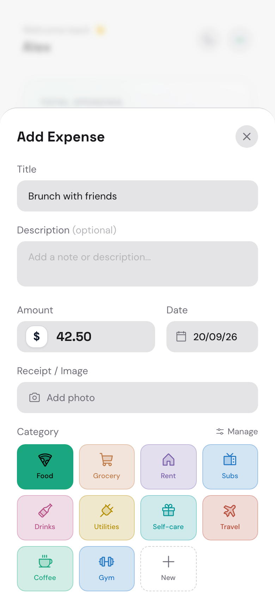 |

## Phase 1b: Insights scope & comparisons

Answers *"My cycle is 25th to 25th, but payday moves."* Full write-up: [01b-insights-scope.md](01b-insights-scope.md).

### Insights: choose the kind of period, compare it fairly
**Why:** v1 had one kind of period (the salary cycle, as this year's month chips) and compared an unfinished cycle with a whole finished one, so September looked −3% cheaper on day 27.
**Change:**
- Tabs for Cycle · Month · Week · Year · Custom, and chips for the last 12 periods of that kind.
- A header with the dates and "Day 27 of 31".
- The comparison is cut at the same point: **+$125.12 (+6%)** vs "last cycle by this point: $2,115.60".
- A "Last 6 cycles" chart with the average as a dashed line.
- A % change next to each category.

| v1 | Phase 0 | Phase 1b |
|---|---|---|
| 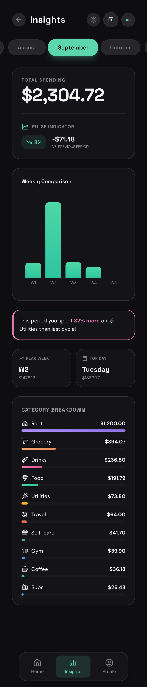 | 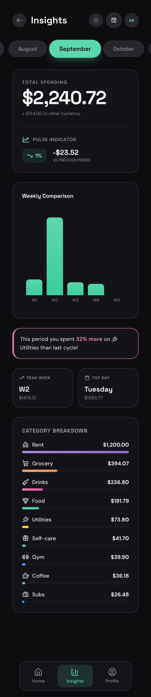 | 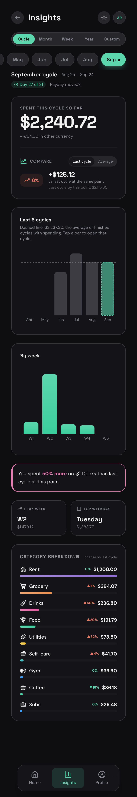 |

### Month, week and year views
**Change:** each period type splits the period in the unit that fits it: by week for cycles and months, by day for a week, and by month for a year. The history chart covers 6 cycles or months, 8 weeks or 3 years. "Average" compares with up to 3 earlier periods, leaving out any with no spending.

| Month (desktop) | Week vs average | Year |
|---|---|---|
| 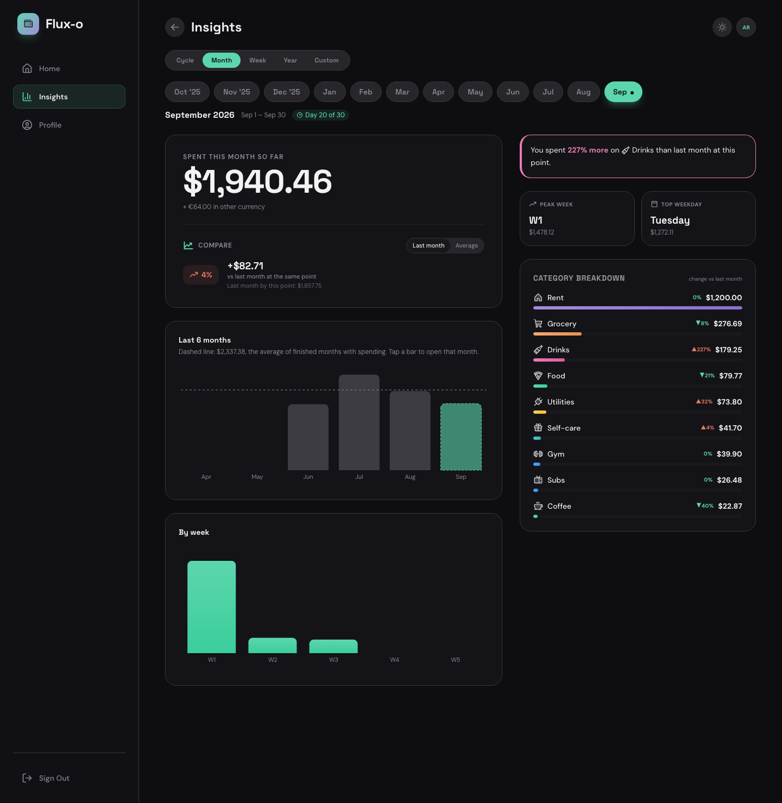 | 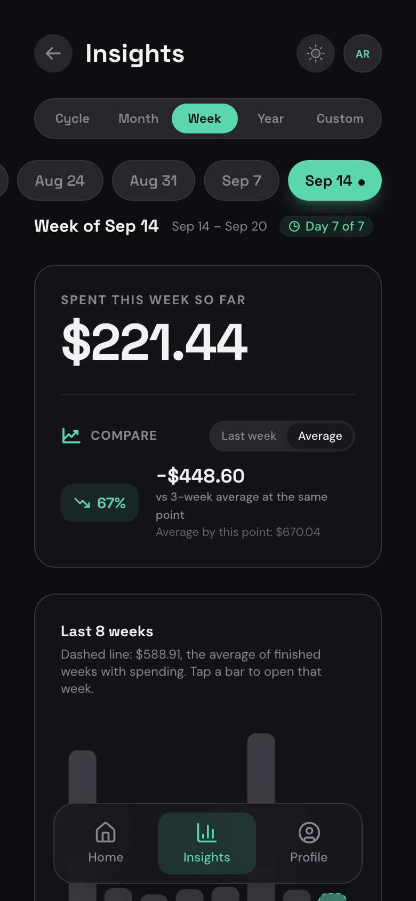 | 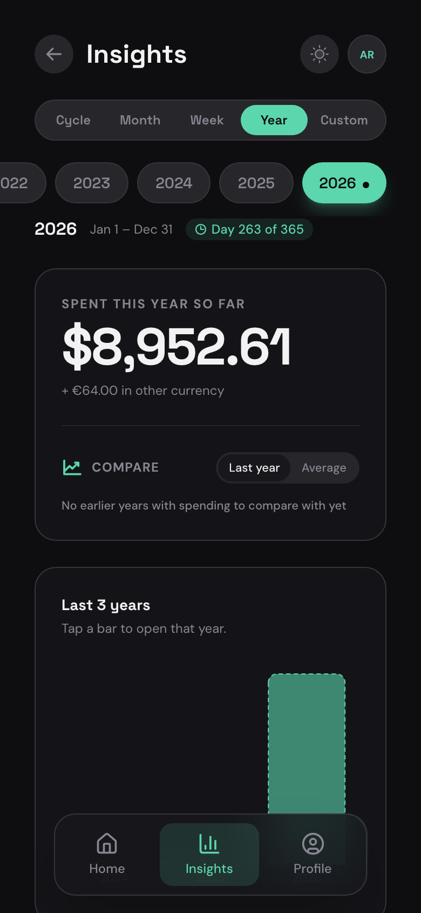 |

### Payday moved
**Why:** when the salary arrives before the 25th, the days in between belonged to the wrong cycle.
**Change:** "Payday moved?" under the period header opens a sheet. Pick the day the salary arrived (up to 10 days either side of the usual day) and choose what happens when the cycle day is on a weekend. After moving the September payday to Fri Aug 21, the header shows the new start, and the total includes Aug 21–24: **$2,369.16**. Home shows the same total.

| The sheet | After the move |
|---|---|
| 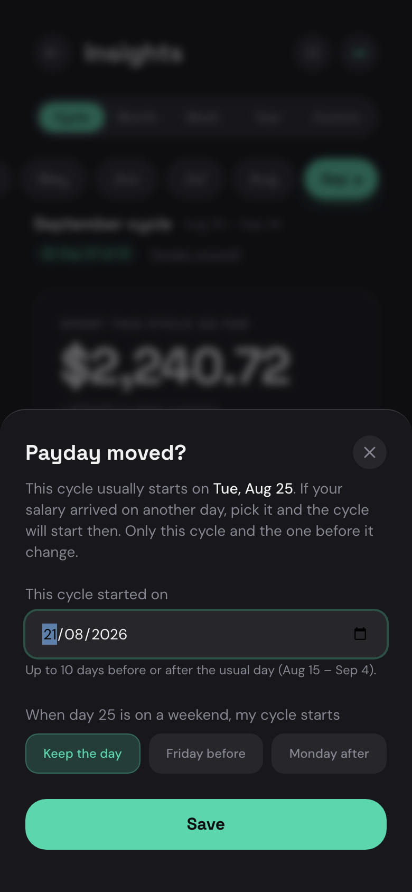 | 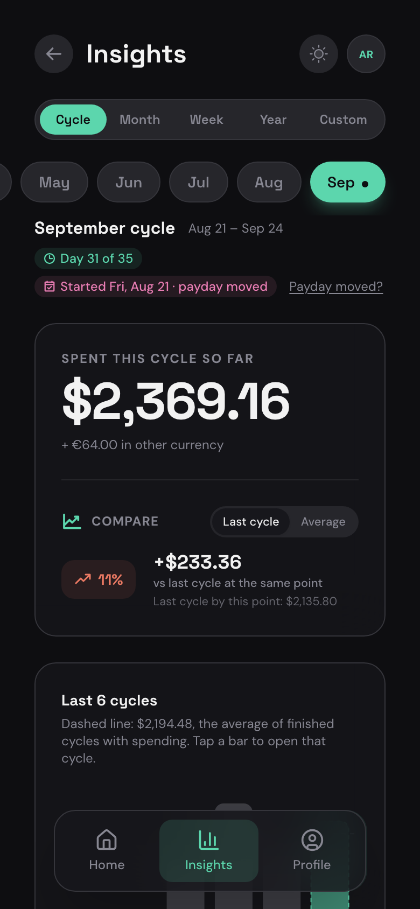 |

### Profile: weekend rule
**Change:** under "Billing Cycle Start Day": *When day 25 is on a weekend, start the cycle on that day / Friday before / Monday after.*

| Phase 1a | Phase 1b |
|---|---|
|  | 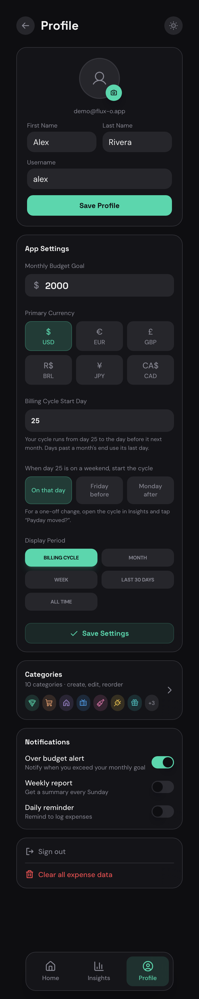 |

## Phase 2: Fast backfill

Answers *"Catching up after a weekend is slow."* Full write-up: [02-fast-backfill.md](02-fast-backfill.md).

### Add expense → "Add several"
**Change:** the Add Expense sheet gets an **Add several** button in its header, which opens the new screen.

| v1 | Phase 2 |
|---|---|
| 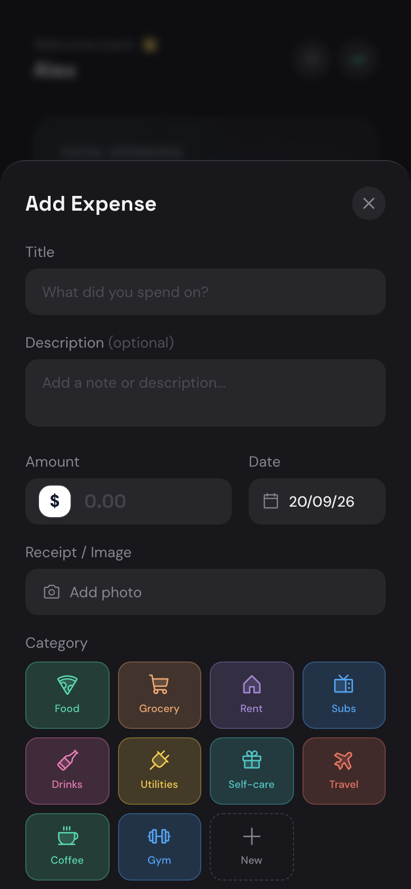 | 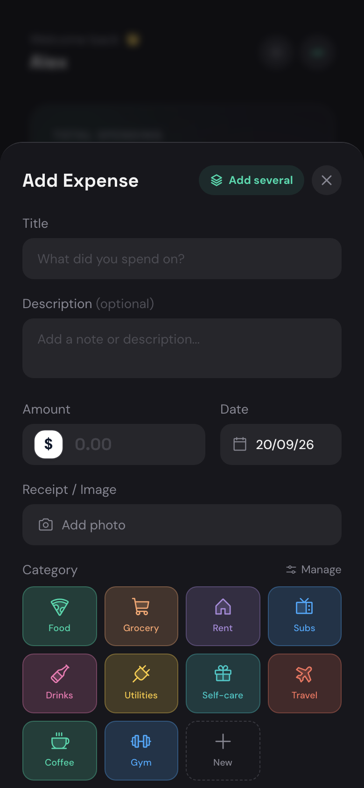 |

### New: Add expenses, by typing
**Why:** in v1 each expense needed the full form.
**Change:** a list of compact rows. Title → Enter → amount → Enter starts the next row with the same date and category. The category is guessed from the title (Brunch → Food, Groceries → Grocery, Uber → Travel), and the Save button shows the count and total.

| Typing three rows |
|---|
| 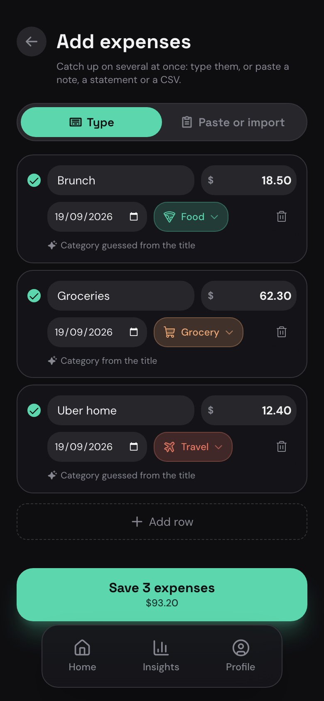 |

### New: paste a note, a statement or a CSV
**Change:** paste one expense per line (`Sat groceries 62,30`) or a table, or choose a CSV file. After reading, a summary says what was found and skipped. Each row explains its category ("from your past expenses", "from the title"), and a line that's already saved is unticked with the reason ("Looks like 'Farmers market' on Sep 19").

| The paste box | After reading (desktop) |
|---|---|
| 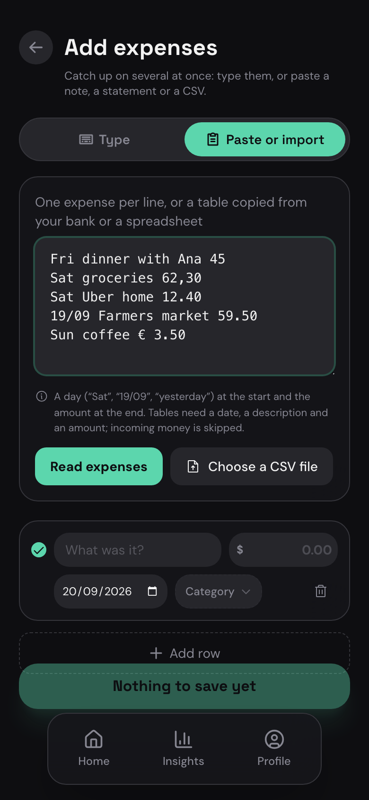 | 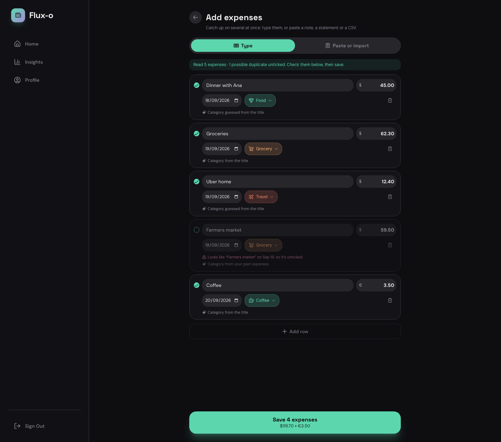 |

### Dark mode: native date pickers
**Change:** date inputs and other native controls now follow the app theme (they were always light).
